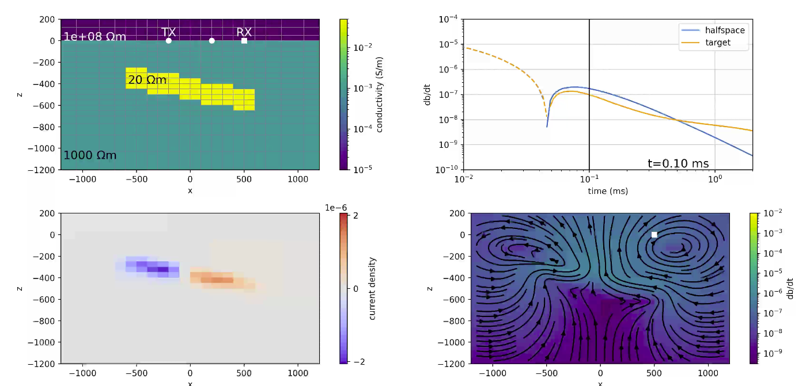

# Overview and recent advances in modelling and inversion of electromagnetic data

Presented at the 2025 Workshop on Ground and Borehole Electromagnetics at RoundUp.

## Abstract

Numerical simulations of electromagnetic data enable us to simulate data, design surveys and visualize the fields and fluxes in an electromagnetic (EM) experiment. Inversions allow us to estimate physical property models from measured data using numerical simulations and optimization machinery. In this talk, I will provide an overview of different strategies that can be used for numerical modelling, such as using analytic solutions or 3D simulations with structured or unstructured meshes, and illustrate how visualizing the EM fields and fluxes can build an understanding of the responses we measure. I will provide a brief overview of the fundamentals of inversion with a focus on challenges specific to electromagnetics. Finally, I will discuss recent advances and active research on the inversion of EM data for mineral exploration using the open-source SimPEG software.

